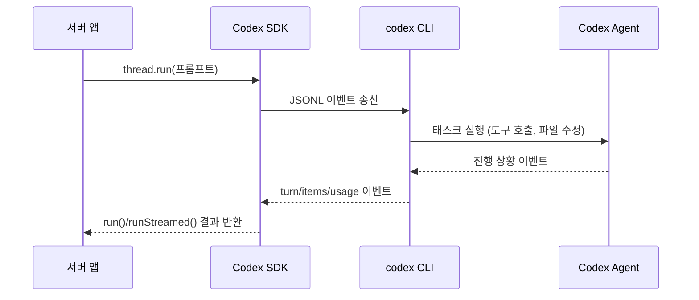

# Codex TypeScript SDK 정리

Codex 공식 문서의 [TypeScript Library 섹션](https://developers.openai.com/codex/sdk#typescript-library)과 GitHub 리포지터리 [`openai/codex`](https://github.com/openai/codex/tree/main/sdk/typescript)의 SDK 소스를 함께 참고해, 서버 사이드에서 Codex를 제어할 때 필요한 지식을 한글로 정리했습니다.

## 1. 핵심 개요
- Codex TypeScript SDK는 **로컬 Codex 에이전트를 애플리케이션에서 직접 제어**하기 위한 도구로, CI/CD, 사내 자동화, 사용자 정의 개발 도우미 등에 적합합니다.
- SDK는 **Node.js 18+** 환경에서 사용하며, 서버 사이드에서 `Codex` 클래스를 통해 **스레드**를 만들고 Codex CLI와 JSONL 이벤트를 주고받습니다.
- Codex CLI, IDE 확장, 웹 UI 대신 **프로그램적으로 Codex를 통제**하고 싶을 때 선택합니다.

## 2. 설치 & 환경 요구사항
- npm 기준 한 줄로 설치합니다.

```bash
npm install @openai/codex-sdk
```

- 설치 후에는 로컬에 설치된 `codex` CLI 바이너리를 SDK가 감쌉니다. CLI는 파일 시스템 변경, 툴 실행, SSE 스트림 관리 등을 담당합니다.
- Codex는 **Git 리포지터리에서 실행되는 것을 기본 전제**로 하며, 실수 방지를 위해 워킹 디렉터리 검사를 수행합니다.

## 3. 동작 구조
- 애플리케이션은 `Codex` 인스턴스를 생성하고 `startThread()`로 Codex 세션을 시작합니다.
- SDK는 **내부적으로 codex CLI 프로세스를 스폰**하고, stdin/stdout으로 JSONL 이벤트를 교환합니다.
- CLI는 로컬 Codex 에이전트와 상호작용하면서 파일 수정, 명령 실행 등 모든 툴 사용 기록을 이벤트로 돌려줍니다.



## 4. 기본 사용 흐름
```ts
import { Codex } from '@openai/codex-sdk'

const codex = new Codex()
const thread = codex.startThread()
const turn = await thread.run('CI 실패를 진단하고 수정안을 제시해줘')

console.log(turn.finalResponse)
console.log(turn.items)
```
- 동일한 스레드에서 추가 지시를 내릴 때는 `thread.run('다음 작업')`을 반복 호출합니다.
- CLI가 남긴 세션은 `~/.codex/sessions`에 저장되므로, `codex.resumeThread(threadId)`로 복구하여 후속 지시를 보낼 수 있습니다.

## 5. 스트리밍 vs 버퍼링
- 기본 `run()`은 한 턴이 끝날 때까지 이벤트를 버퍼링합니다.
- **실시간으로 파일 변경, 툴 호출, 토큰 사용량**을 캐치해야 하면 `runStreamed()`를 사용합니다.

```ts
const { events } = await thread.runStreamed('테스트 실패 원인 분석')

for await (const event of events) {
  if (event.type === 'item.completed') console.log('item', event.item)
  if (event.type === 'turn.completed') console.log('usage', event.usage)
}
```

- 스트림에는 `item.*`, `turn.*`, 툴 실행 알림 등이 포함되어 프런트엔드나 모니터링에 바로 연결할 수 있습니다.

## 6. 구조화된 출력
- Codex는 **JSON Schema**를 턴별로 전달받아, 해당 스키마에 맞는 구조화된 응답을 생성할 수 있습니다.

```ts
const schema = {
  type: 'object',
  properties: {
    summary: { type: 'string' },
    status: { type: 'string', enum: ['ok', 'action_required'] },
  },
  required: ['summary', 'status'],
} as const

const turn = await thread.run('리포지터리 상태를 요약해줘', {
  outputSchema: schema,
})
```

- [Zod](https://github.com/colinhacks/zod) 스키마를 쓰고 싶다면 [`zod-to-json-schema`](https://www.npmjs.com/package/zod-to-json-schema)로 변환해 `target: 'openAi'`를 지정하면 됩니다.

## 7. 멀티모달 입력
- SDK는 **구조화된 입력 배열**을 받아 텍스트와 로컬 이미지를 함께 전달할 수 있습니다.

```ts
await thread.run([
  { type: 'text', text: '스크린샷 두 장을 설명해줘' },
  { type: 'local_image', path: './ui.png' },
  { type: 'local_image', path: './diagram.jpg' },
])
```

- 텍스트 항목은 최종 프롬프트로 이어 붙고, 이미지 항목은 CLI의 `--image` 옵션으로 전달되어 Codex가 시각 정보를 참고하게 됩니다.

## 8. 워킹 디렉터리 및 Git 검사
- Codex는 기본적으로 **현재 워킹 디렉터리**를 분석하고 변경합니다.
- Git 리포지터리를 찾지 못하면 안전을 위해 실행을 거부하지만, 아래처럼 명시적으로 경로를 지정하고 `skipGitRepoCheck: true`로 우회할 수 있습니다.

```ts
codex.startThread({
  workingDirectory: '/path/to/project',
  skipGitRepoCheck: true,
})
```

- CI/CD나 임시 작업 디렉터리에서 사용할 때는 명시적으로 경로와 옵션을 관리해야 합니다.

## 9. 활용 아이디어
- 공식 문서가 제시한 것처럼 **CI 파이프라인, 사내 툴, 사용자 정의 에이전트, 애플리케이션 내 Codex 통합** 등 다양한 자동화에 사용 가능합니다.
- GitHub Actions나 CLI 스크립트에서 SDK를 호출해 **테스트 진단 → 수정 계획 → 패치 구현**까지 하나의 스레드로 이어갈 수 있습니다.
- `runStreamed()` 이벤트를 프런트엔드에 바로 노출하면, Codex CLI가 보여주는 파일 수정/명령 실행 과정을 실시간으로 시각화할 수 있습니다.

## 10. 추가 참고
- 더 많은 예제 코드는 GitHub 리포지터리의 [`sdk/typescript`](https://github.com/openai/codex/tree/main/sdk/typescript) 폴더에서 확인할 수 있습니다.
- 로컬 CLI 동작, SSE 포맷, 스냅샷 전략 등은 `plan.md`에서 추적 중인 “Codex Workflow Hardening” 작업과도 연결되므로, 프로젝트 내에서 SDK를 확장할 때 해당 섹션을 함께 검토하는 것이 좋습니다.

